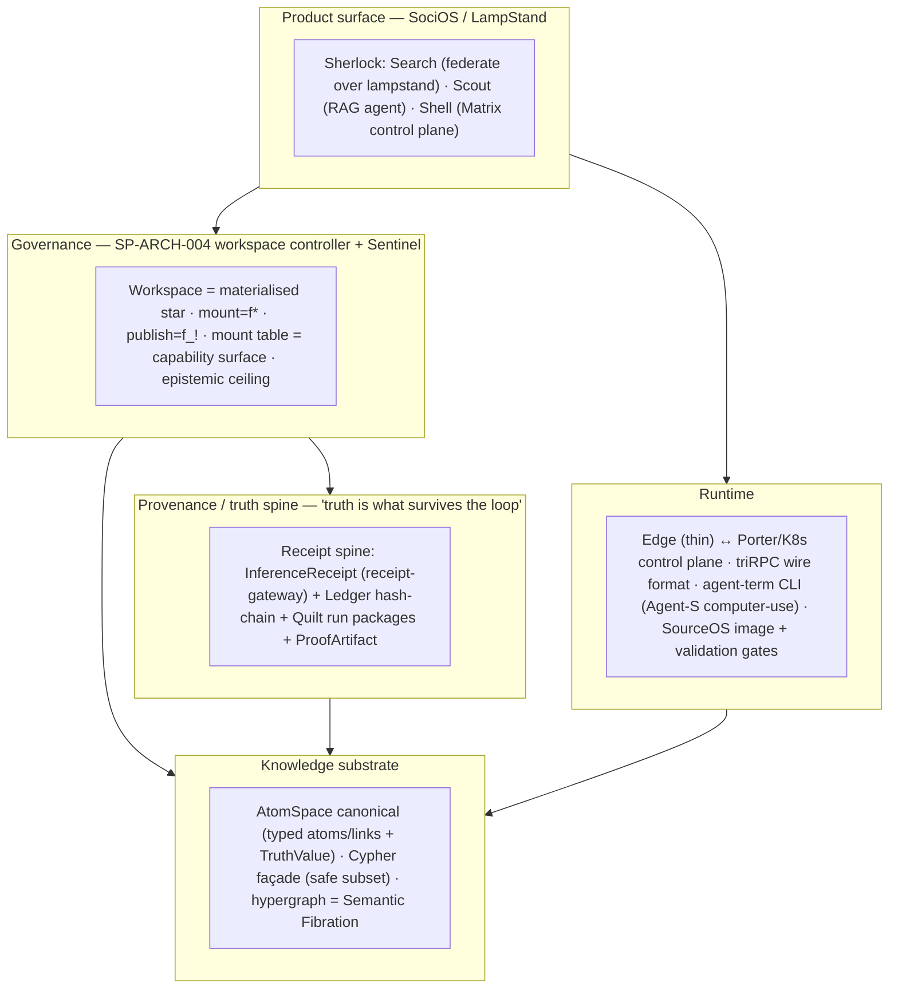
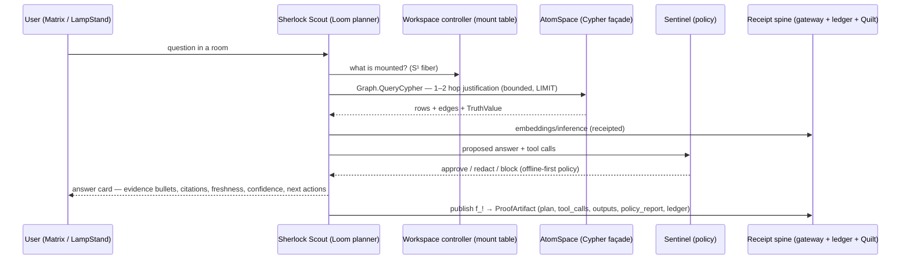
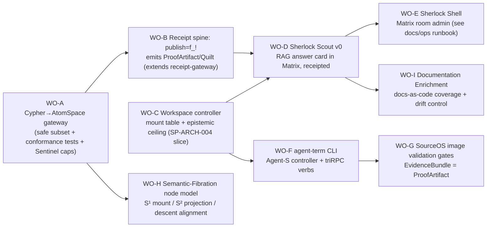

# ADR-0001 — The Open Agent Continuum: Sherlock, the Workspace Controller, and the Receipt Spine

- **Status:** Proposed
- **Date:** 2026-08-03
- **Owner:** @mdheller
- **Related services:** prophet-workspace, prophet-platform (receipt-gateway, embeddings, memoryd, hellgraph-service, sherlock-engine), source-os, sourceos-spec, noetica, lampstand, sherlock-search
- **Related ADRs:** SP-ARCH-001..004 (fibration / workspace-as-star), the Semantic-Fibration worldview note
- **Epistemic status:** `Derived` — this ADR *reconciles* eight in-flight specs into one architecture-of-record. Section 9 lists what each downstream work order must verify against its repo before leaving Proposed.

---

## 1. Why this ADR exists

Eight specs converged in rapid succession — SP-ARCH-004 (Sociosphere workspace controller), Sherlock Scout / Search / Shell, the Documentation Enrichment Program, the Matrix Room-Administration runbook, the agent-CLI / "agent term", the SourceOS Linux image generation & validation corpus, the Semantic-Fibration worldview, and the Open Agent Archetype ("the continuum"). They are **not eight products**. They are one **cognitive operating environment** seen from eight angles. This ADR states the single architecture they share so each can be built as an independent work order without drifting into eight incompatible systems.

**The one-sentence identification:** *Sherlock is the SociOS grounded-agent product for LampStand users; it runs as a governed principal in an SP-ARCH-004 workspace, reasons over the AtomSpace/hypergraph substrate through a Cypher façade, is grounded by the receipt spine, is operated through Matrix rooms, is driven by the agent-term CLI shipped in the SourceOS image behind validation promotion gates, and each node's agent carries its own epistemic fiber through the shared hypergraph.*

---

## 2. The layer stack (what sits on what)

Reading the stack: **every** capability a user or agent exercises flows *down* through the workspace controller (which decides what is reachable) and leaves a trace *in* the receipt/provenance spine (which decides what is true), over the AtomSpace substrate (which holds structure), on the Porter/edge runtime (which executes). The receipt spine already exists in part — `receipt-gateway` fronts embeddings for memoryd/hellgraph/health-twin/sherlock-engine (prophet-platform #1233, #1237). This ADR is the frame that says *why that was step one*.

---

## 3. The two governing adjunctions

The whole system is two adjoint operations, reused at every layer. Nothing else needs inventing.

| Operation | Fibration arrow | Direction | Cost | Gate | Where it shows up |
|---|---|---|---|---|---|
| **mount** | `f*` (restriction) | estate → workspace | free | mount-authority (order in B) | opening a Sherlock session; loading a corpus scope; an agent's tool set |
| **publish** | `f_!` (aggregation) | workspace → estate | settled | policy-fabric + descent + **receipt** | writing a case, promoting a fact, closing an issue, shipping an image |

**AC-1 (the receipt law).** Every `publish` (`f_!`) emits a receipt/ProofArtifact into the spine. A publish without a receipt is a bug, not a feature. This is the estate-wide generalisation of the receipt-gateway: the gateway receipts *inference* publishes; the workspace controller receipts *knowledge* publishes; the image pipeline receipts *build* publishes (its EvidenceBundle **is** a ProofArtifact).

---

## 4. Epistemics: the Semantic Fibration per node (why this is not a metaphor)

Each intelligent mesh node runs an agent that carries its **own epistemic fiber**:

- **S³** — the shared hypergraph (AtomSpace): the full semantic reality all nodes co-inhabit.
- **S¹** — the node/agent's epistemic frame: its orientation, phase, declared extent, mounted cover.
- **S²** — the projected worldview: what *that* agent currently holds as knowledge.

This is operational, not poetic:

- The **mount table** (SP-ARCH-004 §3) is the concrete S¹ fiber — the exact sections currently reachable.
- The workspace's **epistemic level = meet over mounted sections** is the S² projection's ceiling.
- **Ontology↔epistemology are bidirectional** on the same graph: exploring (epistemology→ontology) refines the model; modelling (ontology→epistemology) generates hypotheses tested against it. The neuro-symbolic loop (§6) is exactly this cycle made inspectable.
- **"Truth is what survives the loop"** = a claim that keeps its receipt/ProofArtifact across descent and decay. Divergence of ontology and epistemology = a **misaligned fiber** = a descent obstruction, surfaced (SP-ARCH-004 WS-6), not hidden.

**AC-2 (epistemic ceilings).** External principals (third-party MCP, tenant, foundation model) enter capped at `Derived` (STAR-1). Nothing external reaches `Measured`/`Proved` — certainty you did not compute cannot be imported. Sherlock Scout, as an agent-principal, publishes at `Derived` until its chain of graph-edge + text citations is independently verified.

---

## 5. The neuro-symbolic loop (how an answer is actually produced)

**AC-3 (no handwave).** The plan, the graph edges cited, and the retrieval hits are **artifacts in the run package**, not ephemeral strings. Sherlock's answer contract (concise answer + evidence + citations + freshness + confidence + missing-info + next actions) is the surface of that package.

---

## 6. The seams (one small set of stable verbs — triRPC)

| Verb | Purpose | Owner |
|---|---|---|
| `Graph.QueryCypher(query, params)` | Cypher-subset façade → bounded AtomSpace traversal → rows+plan | cypher→atomspace gateway |
| `Mutations.UpsertAtoms(concepts, edges)` | ingest concepts/edges (+TruthValue) | knowledge fabric |
| `Search.Text` / `Index.Upsert` | lexical/hybrid document retrieval (lampstand/xapian + vector RRF) | sherlock-search |
| `Ledger.Push(run_id, uri, meta)` | provenance pointer into the spine | receipt spine |
| `Alias.Resolve` | command-palette dispatch (agent-term) | agent-term CLI |

**AC-4 (safe subset is enforced, not documented).** Cypher hop-caps, mandatory LIMIT, and no-mutation are enforced in Sentinel *and* the gateway (hard-fail on breach), before any feature that adds `WHERE`/joins. Conformance tests precede feature expansion.

---

## 7. Runtime & delivery

- **Edge thin / Porter durable:** the edge does auth, shaping, streaming; it forwards to the Porter (K8s) control plane where state, jobs, and reasoning live. If the edge is removed, Porter remains the system. (Consistent with the estate's "ship via prophet-platform CI" and the offline-first law.)
- **agent-term CLI:** an Agent-S-style computer-use controller, run in a *controller container* driving *disposable guest VMs* — never a privileged resident. It ships in the **SourceOS image** and is only promoted by the **image validation gates** (build+static+dynamic scenarios+evidence bundle+judgment). The agent-term is the CLI face of the same triRPC verbs.
- **Offline-first by policy:** local providers default; networked providers are explicit, auditable, Sentinel-gated exceptions.

---

## 8. Work orders (the program, sequenced)

Each is an independent PR-able stream; the arrows are hard dependencies. **The thin vertical slice is WO-A → WO-B → WO-D** (substrate façade, one receipted publish, one agent answer in a room) — that proves the continuum end to end before anything else is built on it.

Each WO is filed as a tracked issue (see `docs/PROGRAM_GAPS_AND_OPEN_OBLIGATIONS.md` for the register and the per-WO acceptance criteria).

---

## 9. Open obligations (verify before any WO leaves Proposed)

1. **Repo divergence (SP-ARCH-004 §12.1):** verify prophet-workspace actually distinguishes `publish` from `save` and has a mount-authority check before granting; do not build on inferred shape.
2. **AtomSpace canonical vs Neo4j mirror:** hold the "mirror only, never dual-truth" line; a conformance test must fail if Neo4j is treated as authority.
3. **Relation-normalization map is an API:** version it and test migrations, or CSKG ingestion silently forks (same class as the embedding-space fork fixed in Noetica #602 — see `[[feedback_embedding_space_pin_all_paths]]`).
4. **Receipt-gateway as SPOF/chokepoint:** now the shared embed path for 4 services on a single-writer ledger (prophet-platform #1238). Revisit replicas / ledger design before it fronts *publish* traffic too.
5. **Cypher cost model:** the moment `WHERE`/joins land, a cost model is mandatory or agents issue accidental expensive queries.
6. **Descent as DoS:** a few bad sections can close a high-extent gate (SP-ARCH-004 §12.5); minimum-cover-fraction is mitigation, not solution.
7. **Superconscious falsification harness** has not run; stays out of external material until it passes.

---

## 10. Acceptance criteria (program-level)

- [ ] The thin slice (WO-A→WO-B→WO-D) answers one real question in a Matrix room with a citation-bearing card **and** a replayable ProofArtifact.
- [ ] Every `publish` in the slice emits a receipt; a publish path with no receipt fails a test (AC-1).
- [ ] An external principal is capped at `Derived` and cannot widen its own mount table (AC-2).
- [ ] The Cypher subset rejects an unbounded query at both Sentinel and the gateway (AC-4).
- [ ] Every runtime object named in this ADR has an owning doc page (Documentation Enrichment Program, `docs/README.md`).
