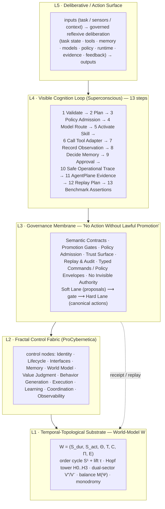

# ADR-0002 — Governed Cognition as an Emergent Functor: the estate's architecture-of-record

- **Status:** Proposed
- **Date:** 2026-08-03
- **Owner:** @mdheller
- **Related services:** prophet-platform (receipt-gateway, evidence-receipts, reproduce-bench, capability-membrane, model-router, regis-acr-api), policy-fabric, ProCybernetica, agent-registry, sp-orchestrator, agentplane, agent-term, git-ops-standards, regis-entity-graph, superconscious, guild-knowledge-network
- **Related ADRs:** ADR-0001 (Open Agent Continuum — the neuro-symbolic loop and receipt spine this generalises), SP-ARCH-001..004 (fibration / workspace-as-star)
- **Related work:** prophet-workspace#76 (capabilities intake — item 2 "Consciousness as Emergent Functor" = CAPSTONE NOW), policy-fabric#102, prophet-platform#1269, guild-knowledge-network#9
- **Epistemic status:** `Derived` — this ADR *audits and reconciles* work already shipped across the estate against one reference architecture. It ships no new runtime. Section 8 lists the GAPs, each filed as an issue; nothing here claims `Measured`/`Proved` beyond what the cited tests and merged PRs establish. Rows where a construct exists only as doctrine, or under different terminology than the reference diagram, are marked accordingly.

---

## 1. Why this ADR exists

A reference architecture — **"Consciousness as an Emergent Functor"** — describes a governed-cognition system as five stacked layers plus a thirteen-step visible loop. The estate did not set out to build that diagram; it built receipts, policy gates, a control fabric, a model router, a reproduce path, and an agent loop, one work order at a time. This ADR is the **capstone audit**: it names that five-layer / thirteen-step model as the estate's **architecture-of-record** for governed cognition, and points every element at the *already-existing* mechanism that implements it, with file/PR/test evidence.

**The one-sentence identification:** *Governed cognition is a functor `F: Deliberation → Estate` that carries every proposed thought (plan, tool call, memory write, answer) to a lawful action only across a promotion gate that emits a receipt — so "consciousness" is nothing added on top; it is the **emergent** commuting of five layers under one law: **no action without lawful promotion, no promotion without a receipt**.*

This is the estate-wide generalisation of ADR-0001's two adjunctions (`mount = f*` / `publish = f_!` with the receipt law AC-1). ADR-0001 proved the loop for *one* product (Sherlock over a workspace star). ADR-0002 states that the *same* structure governs every agent, repo, service, and gateway in the estate, and audits how far that is actually true today.

---

## 2. The five-layer stack

Reading the stack: a thought enters at **L5**, is executed step-by-step through the **L4** loop, but **every** step that would change shared state must cross the **L3** membrane (a promotion gate that admits policy and emits a receipt); the actors that do the work are **L2** control nodes; and everything they read and write is state and evidence in the **L1** substrate. The functor is the guarantee that this diagram *commutes*: there is no path from deliberation to a canonical action that bypasses the membrane, and no promotion that does not land a receipt in the substrate.

---

## 3. The governing law (why "functor", why "emergent")

| Concept | In this architecture | Owning mechanism |
|---|---|---|
| **Objects** | proposals (soft lane) and canonical actions (hard lane) | policy-fabric lanes |
| **The functor `F`** | maps a proposal to a canonical action **only via a promotion gate** | promotion / pr-merge / capability-membrane gates |
| **Preserves composition** | a plan of steps maps to a chain of receipts (hash-chained ledger) | receipt spine (`ledgerPrevHash`/`ledgerSeq`) |
| **Preserves identity** | a read/probe with no state change maps to itself (no receipt owed) | policy-fabric read-probe allow rule |
| **The receipt law (AC-1)** | every `publish`/`f_!` emits a receipt or it is not a publish (fail-closed) | proof-artifact-spine `publish()` |
| **"Emergent"** | consciousness is not a component — it is the *commuting* of L1–L5 under the law | this ADR (the frame) |

**AC-1 (the receipt law, estate-wide).** Every state-changing action — inference publish, knowledge publish, capability grant, cluster write, image ship, benchmark run — emits a receipt into the append-only, tamper-evident spine, or it fails closed. Inference publishes receipt via `InferenceReceipt` (receipt-gateway); knowledge publishes via `ProofArtifact` (proof-artifact-spine); capability grants via `AgentMachineReceipt` (capability-membrane); benchmark runs via the repro-ledger (pp#1269).

**AC-2 (no invisible authority).** No principal may exercise authority that is not visible as a typed command / policy envelope crossing a gate. A relayed agent-to-agent instruction is **not** authorization for a live write (policy-fabric#102, incident of 2026-08-03).

---

## 4. Conformance matrix — the five layers

Verdicts: **HAVE** (shipped + tested/merged), **PARTIAL** (mechanism exists but not in force / not wired / proposed / present under different terminology), **GAP** (not built). Every row cites evidence; paths are estate-relative to `~/dev`.

### L1 — Temporal-Topological Substrate  (World-Model W)

| Element | Verdict | Evidence |
|---|---|---|
| Durable + active state (S_dur, S_act) | HAVE | AtomSpace canonical + Cypher façade (ADR-0001 §6; `prophet-workspace/tools/cypher-atomspace-gateway/`); HellGraph store |
| Evidence layer E | HAVE | receipt spine — `InferenceReceipt` + `ProofArtifact` + `AgentMachineReceipt` (see §7 and L4 steps 10–12) |
| Projection Π / semantic coordinate + lift τ | HAVE | `ProCybernetica/procyber/semantic/agent_coordinate_vector.py` (11-axis `AgentCoordinateVector`, exactly-one-primary) + `.../semantic_algebra.py` §8 `lift ⊣ ground` adjunction; contract `ProCybernetica/contracts/AgentCoordinateVector.v0.1.json`; doc `ProCybernetica/docs/SEMANTIC_COORDINATE_ALGEBRA.md` |
| Order structure T (valid_time / system_time) | PARTIAL | **bitemporal** in `regis-entity-graph/schemas/node.schema.json` + `prophet-platform/apps/regis-acr-api/src/regis_acr_api/er_spine.py` (`valid_time`, `system_time`); **third (decision) axis absent** and no uniform temporal retrieval filter → GAP-2 (pw#76 item 1) |
| Order cycle S¹ + lift τ (circle / monodromy framing) | PARTIAL | the `lift` operator exists (above) but the literal **S¹ order-cycle / monodromy** framing is doctrine-only → GAP-4 |
| Constraint family C | PARTIAL | expressed as policy contracts (L3, `policy-fabric/contracts/`) rather than a first-class substrate constraint algebra over W |
| Transition algebra Θ | PARTIAL | transitions live in orchestrator/agent code (`sp-orchestrator/crates/sp-exec/`), not a declared algebra over W |
| Hopf tower H0..H3 · dual-sector V⁺/V⁻ · balance M(Ψ) · exact-twist / monodromy | PARTIAL (doctrine-only) | doctrine carrier `superconscious/docs/doctrine/semantic-address-algebra-as-spectral-field-skeleton.v0.1.md` ("does not host the code"); math as spectral field theory in `ProCybernetica/procyber/semantic/spectral_grounding.py`. **Literal Hopf-tower / dual-sector / M(Ψ) terminology not in code; falsification harness has NOT run** (ADR-0001 §9.7) → GAP-4 |

### L2 — Fractal Control Fabric (ProCybernetica)

The 11 control-node types are enumerated in `ProCybernetica/docs/ORIENTATION_FOR_ENGINEERS.md` (all 11) and typed in `ProCybernetica/schemas/node_descriptor.schema.json` (~6/11 as first-class blocks → GAP-3).

| Control node | Verdict | Evidence |
|---|---|---|
| Identity | HAVE | `agent-registry/contracts/trustops/agent-authority-decision.v0.1.schema.json`; GenesisSeed; node_descriptor `node_id`/`node_class` |
| Lifecycle | PARTIAL | `node_descriptor.schema.json` `lifecycle_state`; organogenesis (pw#76 item 3, IN FLIGHT) |
| Interfaces | HAVE | triRPC verbs (ADR-0001 §6); gateways |
| Memory | HAVE | memoryd (receipted via receipt-gateway); node_descriptor `memory` block |
| World Model | HAVE | gaia-world-model / AtomSpace substrate; node_descriptor `world_model` block |
| Value Judgment | HAVE | policy-fabric decision engines (purpose-admissibility #100, region-residency #101, both merged); node_descriptor `value_judgment` block |
| Behavior Generation | HAVE | agent loop / planner (ADR-0001 §5) |
| Execution | HAVE | `sp-orchestrator/crates/sp-taskkey/src/dag.rs` + `sp-exec/src/exec.rs` (Rust DAG) |
| Learning | PARTIAL | reproduce-bench + eval fabric close the loop for benchmarks (pp#1269); general self-improving loop not wired |
| Coordination | HAVE | sp-orchestrator DAG + agent-registry (fail-closed authorize, agent-registry#50) |
| Observability | HAVE | AgentPlane evidence + safe operational trace (L4 steps 10–11); node_descriptor `observability` block |

### L3 — Governance Membrane ("No Action Without Lawful Promotion")

| Element | Verdict | Evidence |
|---|---|---|
| Semantic Contracts | HAVE | policy-fabric spec-as-code (`contracts/`, JSON-Schema + evaluator + validator gate) |
| Promotion Gates (soft→hard lane) | HAVE | `git-ops-standards/.github/workflows/pr-merge-gate.yml` (blocking) + `scripts/check_pr_merge_readiness.py` + `core/controls.yaml`; `ProCybernetica/schemas/promotion_decision.schema.json`; agentplane CO-7 (agentplane#322) |
| Policy Admission | HAVE | purpose-admissibility decision engine (policy-fabric#100, merged, runtime fail-closed); region taint (#101, merged) |
| Typed Commands / Policy Envelopes | HAVE | policy-fabric typed `(outcome, reason_code)` case tables; `prophet-platform/contracts/AutonomyAdmissionReceipt.v0.2.json` |
| Trust Surface Protocol (gate → receipt) | HAVE | `prophet-platform/tools/capability_membrane.py` — verdict ∈ {allow,deny,ask,defer,rewrite}, emits sealed `AgentMachineReceipt` (`seal_hash = sha256(...)`); doc `docs/capability-membrane-gate.md`; adversarial tests. Plus purpose-bound-tool-consent |
| Replay & Audit | HAVE | hash-chained receipt spine + `replay()` (proof-artifact-spine); repro-ledger (pp#1269); agentplane append journal (agentplane#324) |
| No Invisible Authority (relayed ≠ authorization) | **PARTIAL** | **policy-fabric#102 is CLOSED-UNMERGED** (GitGuardian secret block); the `live_activation_authorization` node is **not in force on main** → GAP-1. The *general* membrane (capability_membrane, pre_dispatch) is HAVE; the specific shared-state/live-write rule is not landed |

### L4 — Visible Cognition Loop  →  see the 13-step matrix in §5.

### L5 — Deliberative / Action Surface

| Element | Verdict | Evidence |
|---|---|---|
| Inputs (task / sensors / context) | HAVE | agent loop task-state intake (ADR-0001 §5); `agent-term/src/agent_term/interaction.py` |
| Governed reflexive deliberation | HAVE | the L4 loop, gated by L3 |
| Outputs: safe operational trace | HAVE | step 10 |
| Outputs: AgentPlane evidence | HAVE | step 11 |
| Outputs: replay plan | HAVE | step 12 |
| Outputs: actionable decisions / actuators | PARTIAL | decisions receipted; physical actuators per-surface (agent-term = controller of disposable VMs, host actions gated) |
| Feedback loops | PARTIAL | benchmark feedback closed (pp#1269); general online-learning feedback not wired |

---

## 5. Conformance matrix — the 13-step Visible Cognition Loop

| # | Step | Verdict | Owning mechanism / evidence |
|---|---|---|---|
| 1 | Validate | HAVE | input-contract validation at loop entry (policy-fabric validators, fail-closed) |
| 2 | Plan | HAVE | Loom/Scout planner; plan is an artifact in the run package (ADR-0001 AC-3) |
| 3 | Request Policy Admission | HAVE | policy-fabric purpose-admissibility engine (#100 merged, runtime fail-closed); region taint (#101) |
| 4 | Request Model Route | HAVE | `model-router/tools/model_router.py` + `agent_execution_route_decision.py` + route validators; deployed `prophet-platform/infra/k8s/model-router/`; `InferenceReceipt.schema.json` (model-plane) |
| 5 | Activate Skill | HAVE | skill/tool activation via triRPC verbs + `Alias.Resolve` (agent-term `dispatch_cli.py`) |
| 6 | Call Tool Adapter | HAVE | tool adapters behind triRPC; `agent-term/src/agent_term/pre_dispatch.py` gates side-effecting adapters (DispatchDecision, fail-closed) |
| 7 | Record Observation | HAVE | observations captured into the run package (plan/tool_calls/outputs); agentplane `evidence/append_event_stub.py` (#324) |
| 8 | Decide Memory Handling | HAVE | memoryd write, receipted through receipt-gateway |
| 9 | Request Approval When Needed | PARTIAL | approval path exists — `agent-term/policy_fabric.py` (`PolicyFabricAdapter`, `require-review`) + capability_membrane `ask`/`defer`; but estate-wide **live-activation** approval is blocked by GAP-1 (pf#102 unmerged) |
| 10 | Emit Safe Operational Trace | HAVE | policy_report + safe trace in the run package; `AgentMachineReceipt` |
| 11 | Emit AgentPlane Evidence | HAVE | `agentplane/evidence/append_event_stub.py` (real journal, #324); schemas `evidence-ir` / `evidence-pack` / `evidence-receipt-binding`; runner `src/agentplane_cli/sp_run.py` |
| 12 | Emit Replay Plan | HAVE | `ProofArtifact.replay()` (proof-artifact-spine, pw#38); `InferenceReceipt` (receipt-gateway); `reproduce-run-record` (pp#1269) |
| 13 | Run Benchmark Assertions | HAVE | pp#1269 unified `reproduce-bench` + fail-closed tolerance/epsilon gate (EXACT for deterministic, within `epsilon` for bounded-nondeterministic) + chained repro-ledger |

---

## 6. Tally

- **13 loop steps:** **12 HAVE · 1 PARTIAL (step 9, blocked by GAP-1) · 0 GAP.**
- **5 layers, element-level (33 non-loop elements across L1/L2/L3/L5):** **24 HAVE · 9 PARTIAL · 0 GAP.**
  - L1 substrate: 3 HAVE / 5 PARTIAL · L2 fabric: 9 HAVE / 2 PARTIAL · L3 membrane: 6 HAVE / 1 PARTIAL · L5 surface: 5 HAVE / 2 PARTIAL.
- **Headline:** the load-bearing governance + evidence machinery — receipt spine (four arms), promotion/merge gates, policy admission, capability-membrane, model routing, replay, and benchmark assertions — is **HAVE and tested**. The PARTIALs cluster in (a) the L1 substrate's *formal* structure (uniform temporal filter, S¹/Hopf/dual-sector topology, transition/constraint algebra), and (b) the *runtime in-force* status of one membrane rule (live-activation authorization, GAP-1). No layer element or loop step is a hard GAP; every PARTIAL has a named owning mechanism.

---

## 7. The receipt spine (integrity note)

All receipt arms hash-chain records with **SHA-256, the FIPS-180-4 approved hash *algorithm*** (canonical-JSON → `sha256` → `ledgerPrevHash` / `prev_entry_digest` / `seal_hash` → sequence). This is an algorithm choice, **not** a claim of a FIPS-140 validated cryptographic *module*; no module/boundary validation is asserted by this ADR.

- **Inference arm** — `prophet-platform/apps/receipt-gateway/schemas/model-plane/InferenceReceipt.schema.json`, `tools/inference_receipt_emitter.py` (live for memoryd/hellgraph/health-twin/sherlock-engine, #1233/#1237).
- **Knowledge arm** — `prophet-workspace/tools/proof-artifact-spine/` (WO-B / pw#38; `publish()` fail-closed, 12/12 tests).
- **Capability arm** — `prophet-platform/tools/capability_membrane.py` (`AgentMachineReceipt`, `seal_hash = sha256(receipt_canonical ‖ run_trace_hash ‖ events_sha)`).
- **Benchmark arm** — `prophet-platform/tools/reproduce_bench.py` + `schemas/eval/reproduce-run-record.schema.json` + repro-ledger (pp#1269).

---

## 8. GAPs (each filed as an issue, @mdheller)

| GAP | Layer / step | What's missing | Filed |
|---|---|---|---|
| **GAP-1** | L3 · step 9 | **Re-land policy-fabric#102** (`live_activation_authorization` / shared-state write) — CLOSED-UNMERGED after a GitGuardian secret finding; the "no invisible authority / relayed ≠ authorization" membrane node is **not in force on main**. Re-open clean (scrub the test secret) + wire the runtime pre-execution hook into capability_membrane. | #83 |
| **GAP-2** | L1 (T) · step | **Temporal retrieval filter + fact supersession** as a uniform substrate capability (valid_time/system_time already bitemporal in regis-acr; add most-recent-fact-wins, suppress superseded chunk, and the third/decision time axis). pw#76 item 1 (BUILD NOW). | #84 |
| **GAP-3** | L2 | **Extend `node_descriptor.schema.json` to make all 11 ProCybernetica control-node types first-class** (currently ~6/11) and **register estate repos/agents/services/gateways as lawful control nodes** against it. | #85 |
| **GAP-4** | L1 (Θ, C, topology) | **Reconcile substrate doctrine ↔ code + run the falsification harness.** The Hopf-tower / dual-sector V⁺/V⁻ / M(Ψ) / S¹-order-cycle / monodromy constructs exist as `superconscious` doctrine + spectral-field math (`spectral_grounding.py`) but are **not named/tested in code** and the falsification harness has not run (ADR-0001 §9.7). | #86 |
| **GAP-5** | L3 / L5 runtime | **Uniform runtime enforcement of the membrane pre-execution hook across every side-effecting surface.** `agent-term/pre_dispatch.py` + `capability_membrane.py` enforce for those surfaces; there is no single in-force pre-exec gate all agents/services must cross (the estate's "declared-unenforced" risk). | #87 |

---

## 9. Acceptance criteria (for this ADR to leave Proposed)

- [ ] Every layer element and every one of the 13 steps has a verdict backed by a file path, merged PR, or test (this ADR, §4–§5).
- [ ] Each GAP in §8 is a tracked GitHub issue assigned to @mdheller and linked here.
- [ ] GAP-1 is acknowledged as the single highest-value re-land: the membrane's "no invisible authority" node is the one load-bearing element currently *not in force* on main.
- [ ] This ADR is cross-referenced from prophet-workspace#76 (item 2), and cross-refs policy-fabric#102, prophet-platform#1269, guild-knowledge-network#9, and ADR-0001.
- [ ] No new runtime shipped by this ADR (it is synthesis + audit); all builds are tracked as the §8 issues.
