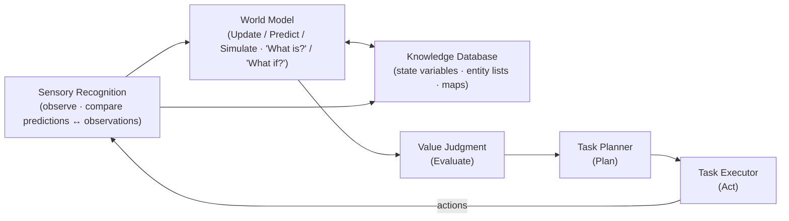

# ADR-0003 — NIST RCS / 4D-RCS as the canonical control-architecture-of-record

- **Status:** Proposed
- **Date:** 2026-08-03
- **Owner:** @mdheller
- **Related services:** ProCybernetica, policy-fabric, prophet-workspace (agent-cognition ER, proof-artifact-spine), gaia-world-model, hellgraph, memory-mesh, metadata-standards, sp-orchestrator, agentplane
- **Related ADRs:** ADR-0002 (Governed Cognition as an Emergent Functor — the estate instantiation this names an ancestor for), ADR-0001 (Open Agent Continuum — the neuro-symbolic loop), SP-ARCH-001..004
- **Related work:** ProCybernetica#124 (ControlNode contract — 11 fractal-control-fabric node types first-class), prophet-workspace#107 (WorldModelSubstrate W), policy-fabric#100/#101/#102 (value-judgment / admission engines), the agent-cognition ER (branch `feat/agent-cognition-er`; **consume, do not duplicate**), ontogenesis#140 (agent-identity conformance audit)
- **Epistemic status:** `Derived` — this ADR is **naming + binding, not a rebuild.** It adopts a published reference control architecture as the estate's named vocabulary-of-record and points each of its six nodes at an *already-existing* estate mechanism, verified in `~/dev` and against merged PRs. It ships no new runtime beyond a single-file conformance validator. Rows where a node's mechanism is thinner than the reference's definition are marked as GAPs (§6).

---

## 1. Why this ADR exists

The estate has, over many work orders, grown a governed-cognition system: a world model, policy/value engines, a knowledge graph, an observation/receipt spine, planners, and executors. ADR-0002 already audited that machinery against a five-layer "emergent functor" reference and named it the estate's architecture-of-record for *governed cognition*.

What ADR-0002 did **not** do is give that control loop its **canonical, citable academic name**. The field already has one: **NIST's Real-time Control System (RCS) / 4D-RCS reference architecture** (Albus et al.) — the reference control node with **Value Judgment**, **World Model**, **Knowledge Database**, **Sensory Recognition**, **Task Planner**, and **Task Executor**, wired into a hierarchical *perception → world-model → value-judgment → plan → act* loop.

This ADR names **RCS / 4D-RCS as the estate's canonical control-architecture-of-record**: the six-node vocabulary below is canonical, and every estate mechanism that plays a control role is identified by which RCS node it instantiates. RCS is the **academic ancestor**; ADR-0002's five-layer functor, ProCybernetica's ControlNode fabric (#124), and the agent-cognition ER are the estate's **instantiations** of it. Naming the ancestor makes the estate's control loop legible to anyone who knows the reference, and gives the conformance check (§5) a fixed vocabulary to test against.

**The one-sentence identification:** *Every control-bearing mechanism in the estate is one of the six 4D-RCS nodes; the estate's cognition loop is the 4D-RCS loop; ADR-0002 and ProCybernetica#124 are how we already built it, and this ADR is the name and the binding that says so.*

---

## 2. The reference: the six 4D-RCS control nodes (canonical vocabulary)

The six nodes are the canonical control vocabulary of the estate. No control mechanism is "new terminology"; it is one of these six, hierarchically composed (an RCS node at one level is itself a full RCS loop at the level below).

---

## 3. The binding — each RCS node → its owning estate mechanism

This is the load-bearing table. Each of the six nodes points at the *already-existing* mechanism (repo / PR / path) that instantiates it. This binding is also expressed, machine-checkable, as the canonical `ControlArchitectureDeclaration` (`examples/control-architecture-declaration.example.json`) that the §5 conformance check verifies.

| RCS node | RCS role | Owning estate mechanism | Evidence / ref |
|---|---|---|---|
| **Value Judgment (VJ)** | Evaluate | ProCybernetica ControlNode `ValueJudgment`; policy-fabric decision engines | `ProCybernetica#124` (ControlNode contract); `policy-fabric#100` purpose-admissibility + `#101` region-residency (both merged, runtime fail-closed); `#102` live-activation authorization (see §6 GAP-A). ADR-0002 L2 "Value Judgment = HAVE". |
| **World Model (WM)** | Update / Predict / Simulate — "What is?" / "What if?" | WorldModelSubstrate W; gaia-world-model / AtomSpace | `prophet-workspace#107` (WorldModelSubstrate descriptor, **merged**); `gaia-world-model`; `node_descriptor.schema.json` `world_model` block. ADR-0002 L1 substrate + L2 "World Model = HAVE". |
| **Knowledge Database (KD)** | State variables, entity lists, maps | HellGraph + memory-mesh + FAIR metadata | `hellgraph` (canonical graph — GRAPH_ENTITY/GRAPH_EDGE); `memory-mesh` (episodic/semantic memory); `metadata-standards` (FAIR forensic-grade metadata record). Agent-cognition ER `GRAPH_ENTITY`/`FAIR_OBJECT`/`FAIR_METADATA`. |
| **Sensory Recognition (SR)** | Observations; compare predictions with observations | OBSERVATION entity + receipt/observation spine | agent-cognition ER `OBSERVATION` (`DECISION_CYCLE consumes OBSERVATION`); ADR-0002 §5 step 7 "Record Observation"; ADR-0001 §5. The *prediction↔observation comparison* is thinner than the reference → §6 GAP-B. |
| **Task Planner (TP)** | Plan | PLAN entity + Loom/Scout planner | agent-cognition ER `PLAN` (`AGENT selects PLAN`); ADR-0001 §5 planner; ADR-0002 §5 step 2 "Plan" (plan is an artifact in the run package). |
| **Task Executor (TE)** | Act | ACTION entity + sp-orchestrator execution DAG | agent-cognition ER `ACTION` (`AGENT emits ACTION`, `gated_by POLICY_CHECK`); `sp-orchestrator/crates/sp-exec/src/exec.rs` + `sp-taskkey/src/dag.rs`. ADR-0002 L2 "Execution = HAVE". |

**Consume-not-fork / consume-not-duplicate.** SR/TP/TE are **not** re-modelled here. Their canonical shape is the **agent-cognition ER** (branch `feat/agent-cognition-er`, entities `OBSERVATION`/`PLAN`/`ACTION` with the `ACTION gated_by POLICY_CHECK recorded_as AUDIT_EVENT` teeth). A concurrent agent owns that ER; this ADR references it as the SR/TP/TE binding and must not restate its schema.

---

## 4. Relationship to ADR-0002 and ProCybernetica#124 (ancestor ↔ instantiation)

RCS is the ancestor; the estate's existing constructs are the instantiations. The mapping is one-to-one and adds no new machinery:

| 4D-RCS node | ADR-0002 five-layer element | ProCybernetica ControlNode (#124) |
|---|---|---|
| Value Judgment | L2 "Value Judgment" · L3 policy admission membrane | `ValueJudgment` |
| World Model | L1 substrate W · L2 "World Model" | `WorldModel` |
| Knowledge Database | L1 state/evidence · L2 "Memory" | `Memory` (+ `WorldModel` maps) |
| Sensory Recognition | L4 step 7 "Record Observation" · L5 inputs | `Observability` (ingest side) |
| Task Planner | L4 step 2 "Plan" · L2 "Behavior Generation" | `BehaviorGeneration` (planning) |
| Task Executor | L4 step 6 "Call Tool Adapter" · L2 "Execution" | `Execution` |

ProCybernetica's fabric enumerates **11** control-node types (Identity, Lifecycle, Interfaces, Memory, World Model, Value Judgment, Behavior Generation, Execution, Learning, Coordination, Observability). RCS's six are the **control-loop core** of that set; the extra five (Identity, Lifecycle, Interfaces, Coordination, Learning) are the estate's hierarchical/organisational extensions of the 4D-RCS node, not contradictions of it. ADR-0002 GAP-3 (make all 11 first-class, ProCybernetica#124) and this ADR are complementary: #124 gives the nodes a typed contract; ADR-0003 names their academic ancestor and pins the loop-core six.

This binding is also relevant to **ontogenesis#140** (agent-identity conformance vs organ/perspective design): the RCS node vocabulary is the control-role axis that identity audit can cite.

---

## 5. Conformance check (with teeth)

A single-file validator — `tools/validate_control_architecture.py` (no new `tools/` module; dependency-light, matching the repo's `validate_*.py` convention) — enforces the vocabulary:

- **T1 shape.** `kind = ControlArchitectureDeclaration`, `metadata.referenceArchitecture = NIST-RCS-4D`, fail-closed on extra fields (mirrors the schema `additionalProperties:false`).
- **T2 all six nodes present.** A declaration naming all six RCS nodes each bound to a mechanism **VERIFIES**; one **missing a node** is **REJECTED**.
- **T3 no dangling ref.** Every node's `mechanismRef` must resolve to a real entry in `spec.mechanisms` (each carrying repo/ref/kind); a **dangling ref** is **REJECTED**.

Artifacts:

- Schema: `schemas/control-architecture-declaration.schema.json` (draft 2020-12, strict; pins the six required nodes and `referenceArchitecture` const — the validator asserts schema↔validator lockstep).
- Canonical declaration (VERIFIES): `examples/control-architecture-declaration.example.json` — the §3 binding, machine-checkable.
- Rejected: `examples/control-architecture-declaration.missing-node.invalid.json` (omits `TaskExecutor`) and `…dangling-ref.invalid.json` (Sensory bound to a non-existent mechanism).
- CI: `.github/workflows/control-architecture.yml`.

Local result: `OK: ControlArchitectureDeclaration validation passed (6/6 RCS nodes bound, 1 example, 2 invalid rejected)`.

---

## 6. GAPs (RCS reference vs estate reality)

Every one of the six nodes binds to a real mechanism (§3), so there is **no whole-node gap**. Two sub-capabilities the reference defines are thinner than the reference and are filed as issues (@mdheller):

| GAP | Node | What's missing | Filed |
|---|---|---|---|
| **GAP-A** | Value Judgment | policy-fabric#102 (`live_activation_authorization` / shared-state write) is **CLOSED-UNMERGED**; VJ's *authority-to-act* gate is not in force on `main`. Same item as ADR-0002 GAP-1. | tracked (ADR-0002 GAP-1 / policy-fabric#102) |
| **GAP-B** | Sensory Recognition | RCS defines SR as the node that **compares predictions with observations** (the discrepancy / prediction-error signal that drives VJ + replanning). The estate **records** observations (OBSERVATION, step 7) but has **no first-class predicted-vs-observed comparator** producing a discrepancy signal into WM/VJ. | prophet-workspace#114 |

GAP-A is not re-filed (it is an existing tracked item); GAP-B is the one RCS-distinctive gap this ADR surfaces and files.

---

## 7. Acceptance criteria (for this ADR to leave Proposed)

- [ ] The six-node vocabulary (§2) is adopted as canonical; new control mechanisms declare which RCS node they instantiate.
- [ ] The §3 binding is expressed as the canonical `ControlArchitectureDeclaration` and VERIFIES under `tools/validate_control_architecture.py`.
- [ ] A declaration missing any of the six nodes, or with a dangling `mechanismRef`, is REJECTED by the same validator (teeth demonstrated in §5).
- [ ] This ADR cross-references ADR-0002, ProCybernetica#124, the agent-cognition ER (consumed, not duplicated), and ontogenesis#140.
- [ ] GAP-B (SR prediction↔observation comparator) is a tracked issue assigned to @mdheller and linked here.

---

## 8. Open items

- **GAP-B issue:** prophet-workspace#114 — a first-class predicted-vs-observed comparator feeding a discrepancy/surprise signal into World Model + Value Judgment.
- **Hierarchy depth:** 4D-RCS is explicitly hierarchical (each node is a loop one level down). This ADR pins the vocabulary at one level; declaring the estate's control *hierarchy* (which node contains which) is follow-on, gated on ProCybernetica#124 landing the typed ControlNode contract.
